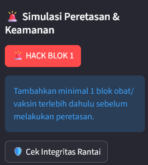
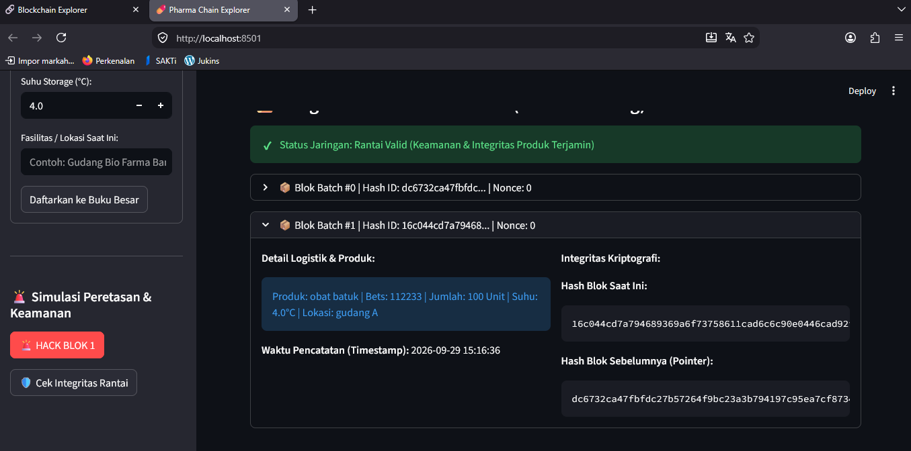
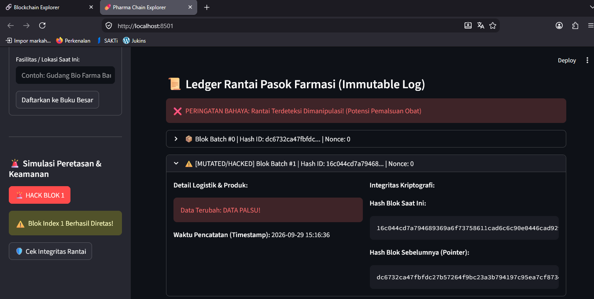
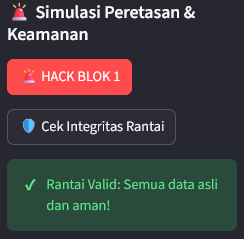
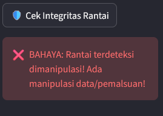

# laporan praktikum3 blockchain

### A. tujuan pembelajaran
1. Mahasiswa memahami konsep Object-Oriented Programming (OOP) pada Python melalui
pembuatan Class.
2. Mahasiswa mampu mengimplementasikan arsitektur modular dengan memisahkan logika
Backend (Core) dan antarmuka Frontend (UI).
3. Mahasiswa dapat membangun struktur Linked List terenkripsi menggunakan Hash
Pointers.
4. Mahasiswa mampu mensimulasikan sistem "Traceability Rantai Pasok Kopi" sederhana di lingkungan lokal.

### B. Konsep Arsitektur Modular
Mulai pertemuan ini, penulisan kode tidak lagi digabung dalam satu file. Aplikasi akan dibagi
menjadi dua bagian utama untuk mencegah spaghetti code:

● core.py : Bertugas sebagai otak sistem (Backend). Berisi struktur data, logika hashing, dan
validasi rantai blok.
● app.py : Bertugas sebagai antarmuka pengguna (Frontend). Menampilkan visualisasi
interaktif ke layar menggunakan Streamlit.

### C. Langkah Kerja Praktikum
#### Tahap 1: Membangun Logika Backend (core.py)
Buka Visual Studio Code dan buat sebuah file baru bernama core.py. Di sinilah kita
mendefinisikan bentuk blok (Class Block) dan rantainya (Class Blockchain). Ketikkan kode
berikut:

#### Tahap 2: Membangun Visualisasi Frontend (app.py)
Buat file kedua bernama app.py di dalam folder yang sama. File ini akan mengimpor logika dari
core.py dan merendernya di web browser.

#### Cara Menjalankan Aplikasi:
Buka terminal, pastikan berada di folder yang sama dengan kedua file di atas, lalu jalankan
perintah: streamlit run app.py

### D. Evaluasi & Tugas Kelompok
Berdasarkan domain industri yang telah disepakati kelompok pada Pertemuan 1 (misal: EHR
Medis, E-Voting, Hak Cipta, dll), kerjakan modifikasi berikut:
1. Laporan Praktikum: Push di Github.
2. Diskusi Kelompok tentukan Thema Projek.

Bukti foto
1. Hack block 1
sebelum masukkan data

### Before

### After

2. Cek Integritas Rantai 
### Before

### After
 
3. Durasi waktu yang dibutuhkan komputer untuk menyelesaikan proses penambangan (mining) dan menambahkan satu blok baru ke dalam rantai mengalami peningkatan drastis (semakin lambat). Alasannya yaitu Algoritma SHA-256 memunculkan kriteria avalanche effect, di mana perubahan 1 karakter kecil saja pada data (seperti mengubah nilai nonce) akan menghasilkan karakter hash yang berubah secara total dan tak terduga. Komputer tidak bisa meramal berapa nilai nonce yang akan menghasilkan pola tertentu, sehingga satu-satunya cara adalah menggunakan pendekatan brute-force (mencoba satu per satu angka nonce = 0, 1, 2, 3, ... sampai cocok).
