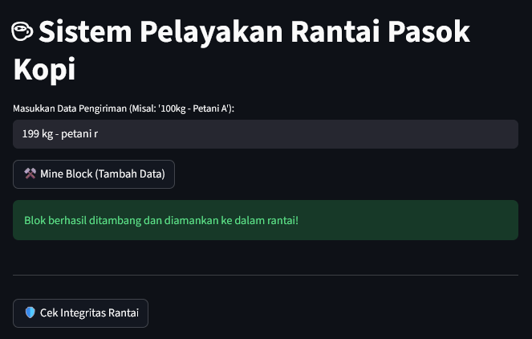
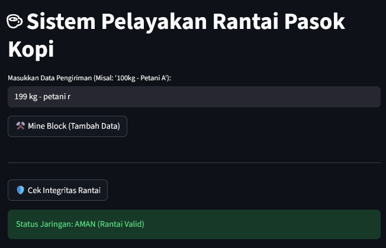
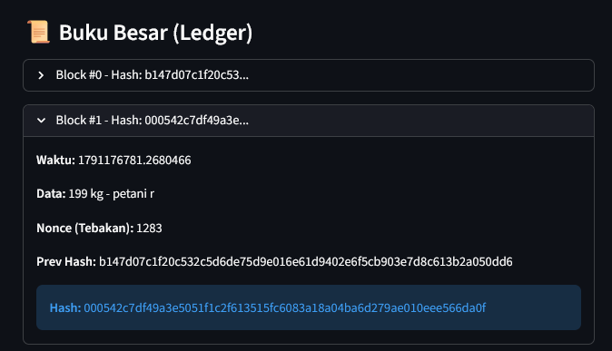

# LAPORAN PRAKTIKUM 5: KONSENSUS JARIKAN & PROOF OF WORK

## A. Tujuan Praktikum
1. Mahasiswa memahami konsep Mempool dan mekanisme validasi transaksi sebelum masuk ke dalam blok.
2. Mahasiswa mampu mengimplementasikan algoritma Proof of Work (PoW) pada struktur Blockchain lokal.
3. Mahasiswa memahami fungsi Nonce (*Number Only Used Once*) dan Difficulty dalam proses mining.
4. Mahasiswa mampu memvalidasi integritas rantai secara keseluruhan menggunakan skrip Python.

## B. Konsep Dasar Proof of Work (PoW)
Pada sistem blockchain nyata (seperti Bitcoin), menambahkan blok baru ke dalam rantai membutuhkan pengorbanan komputasi (*computational work*) agar jaringan aman dari serangan spam. Proses ini dikenal dengan istilah *Mining*.

Sistem akan menetapkan sebuah target (**Difficulty**), misalnya hash blok harus diawali dengan sejumlah angka nol (misal: `000...`). Karena fungsi Hash SHA-256 bersifat acak dan *one-way function*, penambang (*miner*) tidak bisa menebak hasilnya secara langsung[cite: 1]. Oleh karena itu, *miner* harus melakukan pengulangan tebakan menggunakan variabel acak bernama **Nonce** (*Number Only Used Once*) sampai menemukan kombinasi hash yang memenuhi target *difficulty* tersebut[cite: 1].

### C. Langkah Kerja Praktikum

## Tahap 1:
 Membangun Logika Backend (core.py)Menambahkan Atribut Nonce: Menambahkan variabel nonce pada kelas Block sebagai variabel tebakan miner yang ikut dihitung saat kalkulasi hash.   Menyiapkan Tingkat Kesulitan (Difficulty): Menambahkan atribut difficulty pada kelas Blockchain untuk menentukan jumlah awalan nol yang wajib dimiliki oleh hash baru.   Menerapkan Fungsi Mining (mine_block): Membuat mekanisme looping untuk terus menambah nilai nonce dan menghitung ulang hash sampai nilainya memenuhi target difficulty yang ditentukan.   Validasi Integritas Rantai (is_chain_valid): Membangun fungsi pemeriksaan untuk memastikan hash tiap blok masih sesuai dengan datanya serta pointer previous_hash terhubung dengan benar ke blok sebelumnya.

## Tahap 2:
 Membangun Visualisasi Frontend (app.py)Indikator Efek Loading: Menggunakan komponen spinner dari Streamlit untuk memberikan efek loading visual saat proses komputasi mining (Proof of Work) sedang berjalan.   Fitur Cek Integritas: Menambahkan tombol "🛡️ Cek Integritas Rantai" yang terhubung ke fungsi validasi backend untuk menampilkan status jaringan (AMAN atau BAHAYA).   Pemberian Informasi Nonce & Hash: Memperbarui tampilan Buku Besar (Ledger) agar menampilkan nilai Nonce hasil tebakan miner serta menyoroti Hash blok yang sudah berhasil memenuhi syarat awalan nol (difficulty).

 
 
 